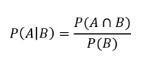
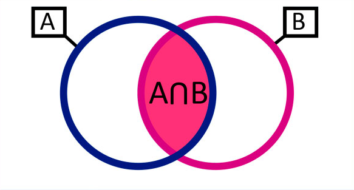
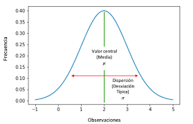
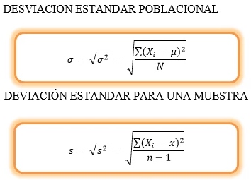

Estadística inferencial
==============================

## Diferencia entre estadística descriptiva e inferencial
_________________________________________________________

### Descriptiva
_______________

Parte de la estadística que nos ayuda adescribir y entenderlos datos, para poder explicar como se comportan los datos en el pasado y en el presente.
También nos ayuda a determinar:

- Tendencia central de variables (Media, Mediana, Moda)
- Variabilidad
- Distribución de las varibles (Unimodal, Bimodal, Multimodal) 

### Inferencial
_______________

Parte de la estadística que nos ayuda a predecir o deducircaracteristicas o resultados esperados en una población y asi validar teorias. En esta parte vemos una abstracción de una muestra para poder determinar:

- Muestreo
- Intervalos de confianza
- Validación de hipótesis
- Evitar sesgos

La inferencia estadística nos permite obtener conclusiones que se obtienen sobre los parametros de una población de datos, ademas, estudiamps el grado de fiabilidd que tenemos de nuestros modelos.

## Estadística inferencial en data science y machine learning
__________________________

La estadística inferencial la usamos tanto en el análisis como en en los modelos predictivos, ya que esta os servirá para:

- Entender la distribución de nuestra información.
- Creación y validación de hipótesis.
- Experimentos.
- Elección adecuada de los modelos predictivos sugún los datos.

## Principales estadisticos
___________________________

### Experimentos
________________

Proceso en el cual un fenomeno se puede realizar infinitamente y tiene un conjunto bien definido de posibles resultados, también es conocido como `espacio muestral`, estos experimentos pueden tener difertentes resultados:

- Aleatorio: si tiene más de un resultado posible.
- Determinista: si solo existe un posible valor.

### Población y muestra
________________________

La población es el conjunto de todos los datos independientemente de sus condiciones, mientras que la muestra es un subconjunto de datos que pertenecen a la población, y esta cuenta con agunas condiciones:

- Número suficiente de registros para ser estadisticamente significativo.
- Representación no sesgada de la información total.

### Eventos
___________

Son cada uno de los posibles resultados derivados de un experimento.

### Variable
____________

Son cada uno de los atributos o caracteristicas que tenemos de las muestras, existen diferentes tipos:

- Cualitativos: atributos no medibles.
-Cuantitativos: atributos medibles, estos son representados por números y existen dos tipos:
    
    - Discretos (son numeros enteros o son aquillos que tienen valores finitos entre dos datos)
    - Continuos (son números decimales o que pueden tomar cualquier valor entre dos datos)

### Probabilidad

Mide que tan posible es qué ocurra un evento determinado bajo ciertas condiciones, el análisis de los eventos probabilisticos se denomina estadística. Dentro de la probabilidad existe una logia llamada probabilidad condicional, esta es; la posibilidad de que ocurra un evento como consecuencia de otro evento pasado, esta está definida como:

### Distribución normal
__________________

La mayoria de los factores del mundo se rigen bajo una `distribución normal`, esta tiene algunas caracteristicas especiales:

- Distribución normal = Distribución de Gauss
- Moda = media = mediana
- Es simétrica
- tiene forma de campana

la mayoria de los datos estan concentrados en el centro, y a los costados estan los datos atipicos y estaria representada por un gráfico como el siguiente.

## Teorema del límite central
_____________________________

La estadistica establece que, dada una muestra aleatoria suficientemente grande de la población la distribución de las medias seguirá una distribución normal.

## Muestreo
____________

Es una técnica que nos ayuda a la selección de una muestra, la cual se obtiene a partir de una población estadística, y esta selección debe de ser aleatoria y se espera que sus propiedades sean extrapolables a la población. Existen algunos tipos de muestreo, aqui vamos a ver los principales:

- Aleatorio simple: Método de selección de ciertas unidades sacadas de una población de tal manera que cada una de las muestras tiene la misma probabilidad de der elegida.
- Sistemático: Este método selecciona ciertas unidades al azay y posterior a ello se eligen el resto de muestras siguiendo intervalos regulares.
-Estratificados:  Este método selecciona ciertas unidades por segmentos exclusivos y homogéneos y posterior a esto se elige una muestra aleatoria simple de cada segmento.

## Media muestral

Debemos recordar algunos conceptos básicos como media, moda y mediana:

- Media: Suma de los datos dividida por la cantidad de los datos.
- Moda: El dato que más se repite.
- Mediana: Es el datoq ue esta en el centro de todos.

La media muestral es la conocida media aritmeticas y esta se obtine al sumar un conjunto de valores cuantitativos y dividirlo por el número total de los elementos sumados. La media muestral es diferente a la media poblacional.

## Varianza y desviación estándar muestral y poblacional

La varianza y me la desviación estándar nos ayudan a calcular que tan dispersa esta una población o muestra, es decir, que tan separadas estan de la media, recordemos que la desviación estándar es la raíz cuadrada de la varianza. Para calcular estas propiedades estadisticas tanto pobalacional como muestral lo podemos hacer con las siguientes ecuaciones.

## Intervalos de confianza

Esto es un par o pares de números entre los cuales se estima que estará un valor desconocido respecto de un parámetro poblacional con determinado nivel de confianza, y estos son simétricos con respecto a la media.

### Nivel de significación

Este nivel de significación o alfa es el nivel límite para juzgar si un resultado es o no es estadisticamente significativo. Si el valor de significación es menor que el nivel de signficación, el resultado será estadisticamente significativo.

## Prueba de hipótesis

Las pruebas de hipótesis o de significación nos ayudan a juzgar si existe alguna diferencia significativaentre el tamaño de la muestra y el parametro general. Para realizar estas pruebas podemos seguir algunos pasos como los que muestro a continuación:

- Establecer una hipótesis nula (H0) y una hipótesis alternativa (H1).
- Seleccionar el nivel de signifiancia.
- Seleccionar el estadistico de prueba.
- Formular la regla de decisión.
- interpretar los resultados y tomar una decisión.

## Tipos de pruebas de hipótesis

- Distribución t de Student: Se usa para estimar una media poblacional normalmente distribuida a partir de una muestra pequeña que sigue una distribución normal y de la que desconocemos la desviación estándar.
- Coeficiente de Pearson: Se usa para medir la dependencia lineal (correlación) entre dos variables aleatorias cuantitativas.
- Análisis de la varianza (ANOVA): Se usa para comparar varianzas entre las medias (o el promedio) de diferentes grupos.

## Tipos de errores

Las conclusiones a las que llegamos se basan en una muestra, por lo que podemos equivocarnos, para esto podemos separar las decisiones en correctas e incorresctas como en la siguiente tabla:

| |H0 Verdadera|H0 Falsa|
|-----------|----------|------------|
|Rechazar H0|Error tipo I P(Error tipo I)=$\alpha$| Decisión correcta|
|No rechazar H0|Decisión correcta| Error tipo II P(Error tipo II) = $\beta$|

## Bootstrapping

Este metodo se usa cuando queremos sacar una muestra de una población, pero la población es pequeña. Esto es, un método de remuestreo de datos de una muestra aleatoria. Se usa para hallar una aproximación a la distribución de la variable analizada. Este metodo nos ayuda a no sesgar los resultados, esto se puede usar en machine learning para evitar el overfitting.

Project Organization
------------

    ├── LICENSE
    ├── Makefile           <- Makefile with commands like `make data` or `make train`
    ├── README.md          <- The top-level README for developers using this project.
    ├── data
    │   ├── external       <- Data from third party sources.
    │   ├── interim        <- Intermediate data that has been transformed.
    │   ├── processed      <- The final, canonical data sets for modeling.
    │   └── raw            <- The original, immutable data dump.
    │
    ├── docs               <- A default Sphinx project; see sphinx-doc.org for details
    │
    ├── models             <- Trained and serialized models, model predictions, or model summaries
    │
    ├── notebooks          <- Jupyter notebooks. Naming convention is a number (for ordering),
    │                         the creator's initials, and a short `-` delimited description, e.g.
    │                         `1.0-jqp-initial-data-exploration`.
    │
    ├── references         <- Data dictionaries, manuals, and all other explanatory materials.
    │
    ├── reports            <- Generated analysis as HTML, PDF, LaTeX, etc.
    │   └── figures        <- Generated graphics and figures to be used in reporting
    │
    ├── requirements.txt   <- The requirements file for reproducing the analysis environment, e.g.
    │                         generated with `pip freeze > requirements.txt`
    │
    ├── setup.py           <- makes project pip installable (pip install -e .) so src can be imported
    ├── src                <- Source code for use in this project.
    │   ├── __init__.py    <- Makes src a Python module
    │   │
    │   ├── data           <- Scripts to download or generate data
    │   │   └── make_dataset.py
    │   │
    │   ├── features       <- Scripts to turn raw data into features for modeling
    │   │   └── build_features.py
    │   │
    │   ├── models         <- Scripts to train models and then use trained models to make
    │   │   │                 predictions
    │   │   ├── predict_model.py
    │   │   └── train_model.py
    │   │
    │   └── visualization  <- Scripts to create exploratory and results oriented visualizations
    │       └── visualize.py
    │
    └── tox.ini            <- tox file with settings for running tox; see tox.readthedocs.io

--------

<small>Project based on the <a target="_blank" href="https://drivendata.github.io/cookiecutter-data-science/">cookiecutter data science project template</a>. #cookiecutterdatascience</small>

